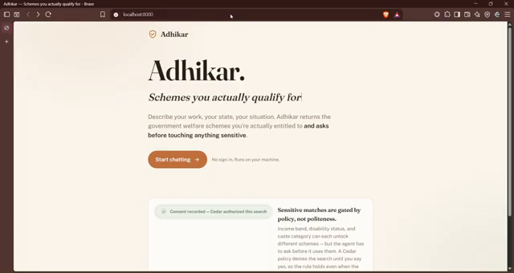
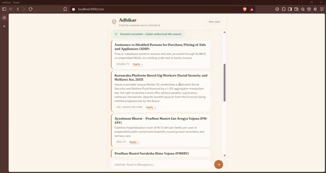
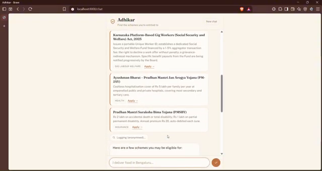
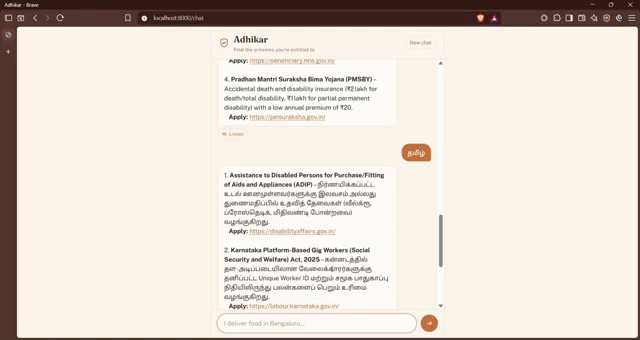
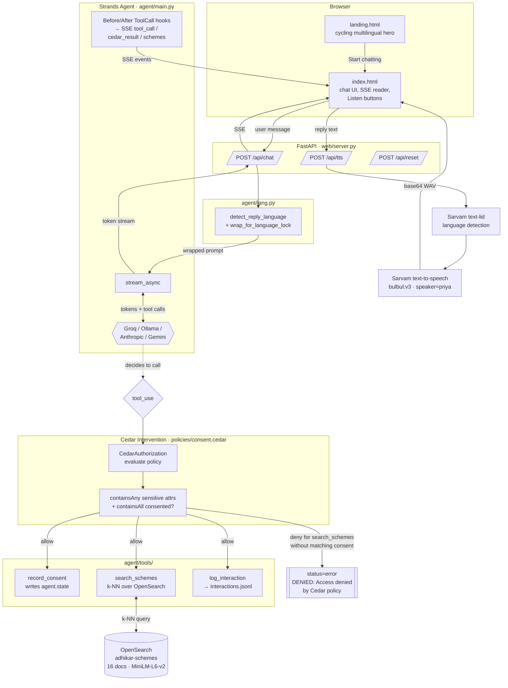

# Adhikar

> **Find the government welfare schemes you actually qualify for — in your own language, with your consent asked before anything sensitive is used.**

[]()
[]()
[]()
[]()
[]()
[]()
[]()

Built for **WeMakeDevs × AWS · First Commit hackathon** (Build It track, 2026).

---

## Why this exists

India runs **3,000+ central and state welfare schemes** — pensions, gig-worker
accident cover, disability aids, maternity benefits, skill credits. The
directory sites already exist. What's missing for informal and gig workers
is a way to say *"I'm a delivery rider in Bengaluru, I have a disability
affecting my leg, no insurance"* and get back the 3–4 schemes that
plausibly apply, in plain language, in the script they read in.

Adhikar is that layer: a **conversational agent** that runs entirely on your
own machine, asks one clarifying question, and returns a shortlist of real
schemes with real apply links — with a **policy-enforced consent gate**
around anything sensitive.

---

## Key features

- **Consent-gated eligibility search.** Income band, disability status,
  and caste category are gated by a **Cedar policy**, not by prompt
  politeness. The agent has to *ask* before it can search on any of them.
  The gate is verified end-to-end with a regression test (`consent_flow_test.py`).
- **Real semantic search** over 16 hand-curated welfare-scheme documents
  (verified against live government portals in 2026), embedded with
  `all-MiniLM-L6-v2` and served from a local **OpenSearch** k-NN index.
- **Multilingual, deterministic.** The system prompt tells the model to
  reply in the user's language; a Unicode-range **script detector**
  (`agent/lang.py`) injects a per-turn language directive to defeat topical
  bias. Verified in **English, Hindi, Kannada, Tamil, Bengali, Telugu** —
  reply stays in-language while the tool query always goes out in English.
- **Voice output via Sarvam AI.** Per-message "Listen" button on each
  agent reply. Backend calls Sarvam `text-lid` to detect the reply's
  language, then Sarvam `text-to-speech` (Bulbul v3, `speaker=priya`).
- **Streaming UI.** FastAPI SSE bridge streams token-by-token replies and
  distinct event types for tool calls, Cedar decisions, and scheme
  results — so the frontend can animate each moment (the "Cedar
  authorized this search" chip with its checkmark drawing in is a
  first-class UI event).
- **Four model providers wired** behind one env var: **Groq**
  (`openai/gpt-oss-120b`, verified end-to-end), **Ollama** (local
  fallback), **Anthropic** (Claude), **Gemini**.
- **Landing page → chat app.** Terracotta-and-ivory design system,
  Fraunces + Public Sans, cycling multilingual tagline. All animations
  respect `prefers-reduced-motion`.

---

## Demo

- **Live URL:** _(local demo only; see [Local setup](#local-setup) below)_
- **Demo video:** **[youtu.be/dx5ptgeN9Dc](https://youtu.be/dx5ptgeN9Dc)** (3:27)
- **Screenshots** (stills pulled from the demo video):

  | | |
  |---|---|
  |  |  |
  | **Landing page** — cycling multilingual hero, "Start chatting" CTA, static Cedar chip as differentiator. | **Cedar consent chip** — the green shield with a drawn-in checkmark appears the moment Cedar authorises `search_schemes` after `record_consent`. |
  |  |  |
  | **Shortlist** — real scheme cards with category tags and official Apply links, staggered in from the SSE `schemes` event. | **Multilingual** — same agent, same schemes, replying in Tamil while still sending an English `query` to `search_schemes` under the hood. |

---

## Architecture



---

## Tech stack

| Layer | Tool | Purpose |
|---|---|---|
| Agent runtime | **Strands Agents SDK** | Event loop, tool dispatch, hooks, streaming |
| Consent gate | **Cedar** (`cedarpy`) via Strands `CedarAuthorization` intervention | Denies `search_schemes` when a sensitive attribute is present without matching consent |
| LLM (verified path) | **Groq** — `openai/gpt-oss-120b` | Reasoning + tool calling; OpenAI-compatible endpoint |
| LLMs (also wired) | Ollama (local llama3.1/qwen2.5), Anthropic Claude, Google Gemini | Provider branches selected via `ADHIKAR_MODEL_PROVIDER` env var |
| Retrieval | **OpenSearch 2.19** single-node + `sentence-transformers` (`all-MiniLM-L6-v2`) | Semantic k-NN search over 16 curated scheme documents |
| Text-to-speech | **Sarvam AI** — `text-lid` + `text-to-speech` (Bulbul v3) | Detects the reply's language, then synthesises audio |
| Web app | **FastAPI** + Server-Sent Events | Streams tokens and typed tool/Cedar events to the browser |
| Frontend | Vanilla HTML/CSS/JS + Google Fonts (Fraunces, Public Sans, 9 Noto Sans Indic families) | Landing page + animated chat UI, no build step |
| Storage | Local `data/interactions.jsonl` | Anonymised usage log (category + result count only) |

---

## Local setup

### Prerequisites

- Python 3.12 or 3.14
- Docker Desktop (for OpenSearch)
- A **Groq** API key (free tier, email signup at [console.groq.com/keys](https://console.groq.com/keys))
- _Optional:_ a **Sarvam** API key (free tier, [dashboard.sarvam.ai](https://dashboard.sarvam.ai)) to enable the Listen button

### 1. Clone

```bash
git clone https://github.com/mallesh-bot/adhikar.git
cd adhikar
```

### 2. Configure environment

The full example file lives at [`adhikar/.env.example`](adhikar/.env.example).
Copy it and fill in the two keys you have:

```bash
cp adhikar/.env.example adhikar/.env
# then edit adhikar/.env and set:
#   GROQ_API_KEY=gsk_...
#   SARVAM_API_KEY=sk_...     # optional
```

> **Never commit your `.env`.** The repo's `.gitignore` already excludes it.
> **Never paste a real key into README, an issue, or a screenshot.**

### 3. Install + run

```bash
python -m venv .venv && source .venv/bin/activate    # Windows: .venv\Scripts\activate
pip install -r adhikar/requirements.txt

# Bring OpenSearch up (single node, healthy in ~10s)
cd adhikar
docker compose up -d
python data/load_opensearch.py   # first run downloads all-MiniLM-L6-v2 (~90 MB)

# Load env vars from adhikar/.env (or export them manually) and start the app
export $(grep -v '^#' .env | xargs)
python -m uvicorn web.server:app --port 8000
```

Then open **[http://localhost:8000/](http://localhost:8000/)** (landing page) or
straight to **[http://localhost:8000/chat](http://localhost:8000/chat)**.

### 4. Run the regression test

```bash
cd adhikar
python consent_flow_test.py
```

Exercises three cases: benign search, direct-call Cedar deny, full
conversational deny → ask → consent → retry.

---

## Project structure

```
.
├── README.md                        <-- you are here
└── adhikar/
    ├── agent/
    │   ├── main.py                  # Agent build; provider branches (groq/ollama/anthropic/gemini)
    │   ├── lang.py                  # Unicode-range script detector + per-turn language lock
    │   └── tools/
    │       ├── search_schemes.py    # k-NN search; sensitive_attributes REQUIRED (no default)
    │       ├── record_consent.py    # writes agent.state; Cedar reads it back
    │       └── log_interaction.py   # anonymised event → data/interactions.jsonl
    ├── web/
    │   ├── server.py                # FastAPI: /api/chat (SSE), /api/tts, /api/reset, /, /chat
    │   └── static/
    │       ├── landing.html         # cycling multilingual hero + CTA → /chat
    │       └── index.html           # chat UI: Cedar chip, scheme cards, Listen buttons
    ├── data/
    │   ├── schemes/*.json           # 16 curated welfare scheme documents
    │   ├── load_opensearch.py       # embeds + indexes them
    │   └── interactions.jsonl       # runtime log, gitignored
    ├── policies/
    │   └── consent.cedar            # forbid search_schemes on sensitive attrs w/o consent
    ├── docker-compose.yml           # OpenSearch 2.19 single-node
    ├── consent_flow_test.py         # end-to-end regression (Tests 1–3)
    ├── conversation_design.md       # the 6-turn flow, drafted before any code
    └── .env.example                 # template; never commit .env itself
```

Developer-facing setup notes and a per-commit "what's verified" log live in
[`adhikar/README.md`](adhikar/README.md).

---

## My contributions

I built everything in this repo — the scheme corpus curation, the Strands
agent wiring with the Cedar consent gate, the FastAPI SSE bridge with typed
tool events, the OpenSearch retrieval, the four-provider LLM switch, the
script-based per-turn language lock, the Sarvam TTS integration, and both
frontend pages (landing + chat) with the animations. The demo you see in
the video is running the same code committed here.

---

## Hackathon context

Adhikar was built solo for the **WeMakeDevs × AWS · First Commit hackathon**,
Build It track (submission deadline 2026-09-20 — <!-- TODO: adjust if you
extended -->). The track's constraint was "runs on your own machine, no
managed cloud account required," which shaped the local-first choices:
OpenSearch instead of Amazon OpenSearch Service, Cedar via `cedarpy`
instead of Verified Permissions, `data/interactions.jsonl` instead of a
Lambda-backed analytics pipeline.

---

## Future improvements

- **More schemes.** 16 is enough to prove the pipeline; a real deployment
  needs an ETL over the ~3,000-scheme `myScheme.gov.in` catalogue with
  freshness tracking.
- **Voice input**, not just voice output. Sarvam's `saarika` speech-to-text
  would close the loop for users who prefer to speak.
- **Real user personas** — a low-literacy delivery-worker mode with icon
  affordances and simpler wording, evaluated with actual users.
- **Cedar policies for more than just consent** — for example, refuse to
  recommend schemes whose eligibility text hasn't been re-verified in the
  last 90 days.
- **Multi-turn eligibility "why not X?"** — let users ask why a scheme was
  filtered out.

---

## License

**MIT** — see [`LICENSE`](./LICENSE) at the repo root. Scheme names,
benefits, and apply-URLs referenced in `adhikar/data/schemes/*.json` belong
to the respective Government of India / state welfare portals and are used
here for informational purposes only.

---

## Attribution

Built by [@mallesh-bot](https://github.com/mallesh-bot) for the WeMakeDevs
× AWS First Commit hackathon, with pair-programming assistance from
[Claude Code](https://claude.com/claude-code).
